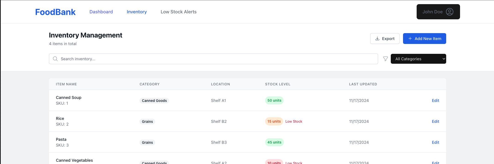

# Food Bank Inventory Management System

A comprehensive web application designed to help food banks efficiently manage their inventory, track stock levels, and maintain organized records of food items.

[FoodBank Project Page](https://codevalve.github.io/foodbank/)

## Features

- **Inventory Dashboard**
  - Real-time overview of all food items in stock
  - Low stock alerts and notifications
  - Quick search and filtering capabilities
  - Category-based organization
  - Stock level indicators with color coding

- **Inventory Management**
  - Add new food items with detailed information
  - Update existing item quantities and details
  - Track minimum stock levels
  - Monitor expiration dates
  - Categorize items for better organization

- **Multi-tenant Support**
  - Designed for multiple food bank locations
  - Location-specific inventory tracking
  - Separate stock management per location

## Screenshots


*Main inventory dashboard showing stock levels and item details*

## Technology Stack

- **Frontend**
  - React with TypeScript
  - Vite for build tooling
  - TailwindCSS for styling
  - React Query for data management
  - React Router for navigation

- **Development**
  - Modern component architecture
  - Responsive design for all devices
  - Type-safe implementation
  - Efficient state management

## Getting Started

1. Clone the repository:
   ```bash
   git clone https://github.com/codevalve/foodbank.git
   ```

2. Install dependencies:
   ```bash
   cd foodbank
   npm install
   ```

3. Start the development server:
   ```bash
   npm run dev
   ```

4. Open [http://localhost:5173](http://localhost:5173) in your browser

## Project Structure

```
foodbank/
├── packages/
│   ├── client/           # Frontend React application
│   │   ├── src/
│   │   │   ├── api/     # API integration
│   │   │   ├── components/
│   │   │   ├── pages/   # Main application pages
│   │   │   └── types/   # TypeScript definitions
│   │   └── ...
│   └── ...
└── docs/                 # Documentation
```

## Contributing

We welcome contributions! Please feel free to submit a Pull Request.

## License

This project is licensed under the MIT License - see the [LICENSE](LICENSE) file for details.
