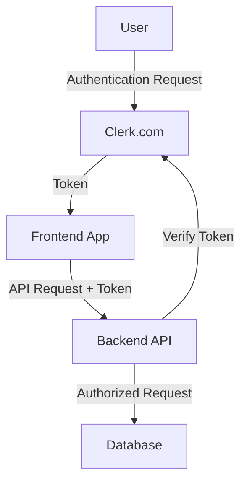
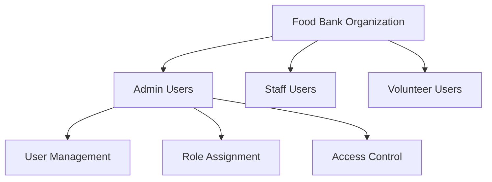

# Authentication System

The Food Bank Inventory Management System uses [Clerk.com](https://clerk.com) for authentication and user management. This document outlines the authentication architecture, setup process, and best practices.

## Why Clerk?

We chose Clerk.com for its robust multi-tenant capabilities and enterprise-grade features:

1. **Multi-tenant Architecture**
   - Organization management for different food banks
   - Hierarchical user permissions
   - Isolated user management per food bank

2. **Enterprise Features**
   - SSO/SAML support
   - Custom domains
   - Advanced security features
   - Compliance (SOC 2 Type 2, GDPR)

3. **User Management**
   - Delegated administration
   - Built-in user directory
   - Role-based access control
   - Audit logs

## Architecture



## Implementation

### Frontend Setup

```typescript
// Example React component with Clerk
import { SignIn } from "@clerk/nextjs";

export default function SignInPage() {
  return <SignIn />;
}
```

### Backend Integration

```typescript
// Example API route protection
import { clerkClient } from "@clerk/nextjs/server";
import { getAuth } from "@clerk/nextjs/server";

export default async function handler(req, res) {
  const { userId } = getAuth(req);
  if (!userId) {
    return res.status(401).json({ error: "Unauthorized" });
  }
  // Continue with authorized request
}
```

## User Roles & Permissions

| Role | Description | Permissions |
|------|-------------|------------|
| System Admin | Platform-wide administration | All permissions |
| Food Bank Admin | Single organization admin | Organization management, user management |
| Staff | Regular food bank staff | Inventory management, basic reporting |
| Volunteer | Limited access users | Data entry, basic inventory views |

## Organization Structure

Each food bank operates as a separate organization within Clerk:



## Security Considerations

1. **Token Management**
   - JWT-based authentication
   - Short-lived access tokens
   - Secure token rotation

2. **Multi-factor Authentication**
   - Optional for all users
   - Required for admin accounts
   - Various 2FA options

3. **Session Management**
   - Configurable session duration
   - Device management
   - Session revocation

## Setup Process

1. **Initial Configuration**
   ```bash
   # Install Clerk SDK
   npm install @clerk/nextjs
   ```

2. **Environment Variables**
   ```env
   NEXT_PUBLIC_CLERK_PUBLISHABLE_KEY=pk_***
   CLERK_SECRET_KEY=sk_***
   ```

3. **Provider Setup**
   ```typescript
   // pages/_app.tsx
   import { ClerkProvider } from '@clerk/nextjs'
   
   function MyApp({ Component, pageProps }) {
     return (
       <ClerkProvider>
         <Component {...pageProps} />
       </ClerkProvider>
     )
   }
   ```

## Best Practices

1. **Organization Setup**
   - Use meaningful organization names
   - Configure custom domains
   - Set up proper role hierarchies

2. **User Management**
   - Enable email verification
   - Configure password policies
   - Set up proper user groups

3. **Security**
   - Enable audit logs
   - Configure session timeouts
   - Set up proper CORS policies

## Migration Guide

For existing food banks migrating to the platform:

1. **Data Preparation**
   - Export user data in compatible format
   - Map existing roles to new system
   - Prepare organization structure

2. **Migration Process**
   - Create organization in Clerk
   - Bulk import users
   - Verify user access

3. **Post-Migration**
   - Verify user permissions
   - Test SSO if applicable
   - Update documentation

## Support and Troubleshooting

For authentication issues:

1. Check the [Clerk Dashboard](https://dashboard.clerk.dev)
2. Review audit logs
3. Contact system administration
4. Consult Clerk documentation

## Future Considerations

- Enhanced SSO integrations
- Advanced audit capabilities
- Custom authentication flows
- Enhanced security features
